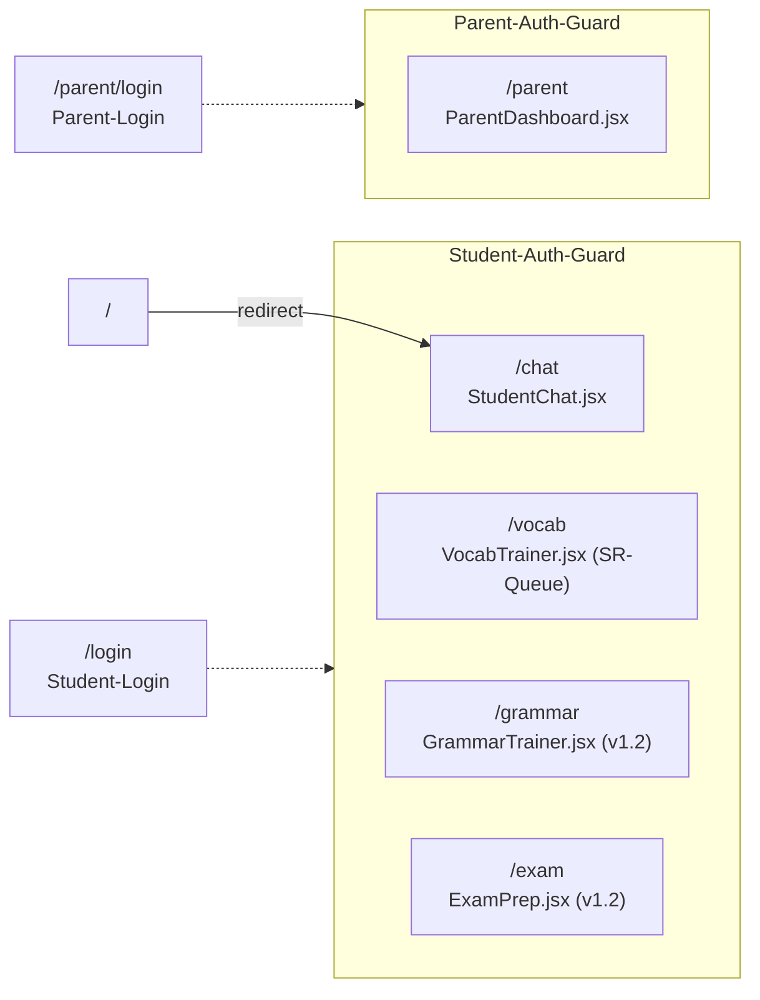
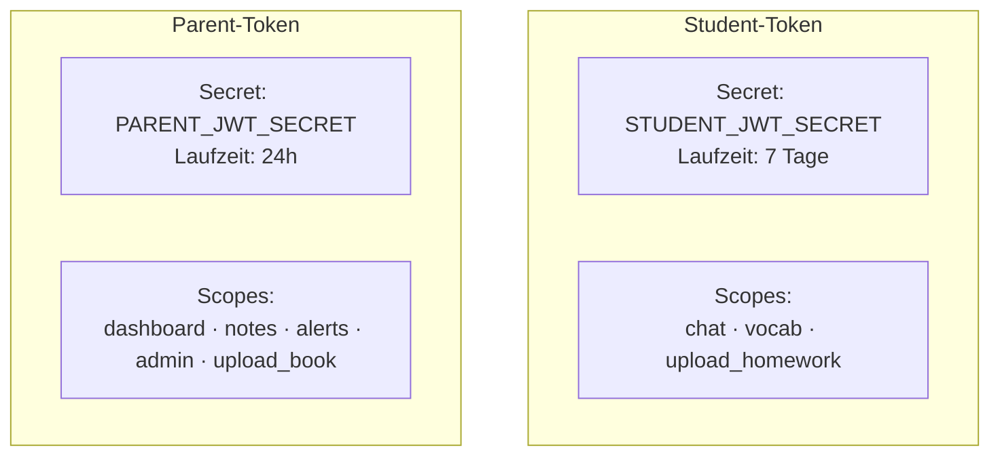
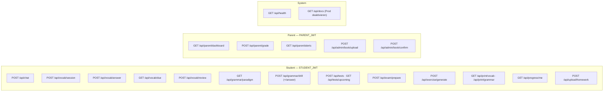

# App-Struktur & APIs

Frontend-Routen, REST-Endpoints und JWT-Auth-Modell.

Zurück zu [[CLAUDE]] · Verwandt: [[architektur]], [[datenbank-modell]]

## Frontend-Routen



## JWT-Auth

Zwei **separate** Secrets, niemals vermischen.



| Token | Secret (Env-Var) | Laufzeit | Scopes |
|-------|-----------------|---------|--------|
| Student | `STUDENT_JWT_SECRET` | 7 Tage | `chat`, `vocab`, `upload_homework` |
| Parent | `PARENT_JWT_SECRET` | 24h | `dashboard`, `notes`, `alerts`, `admin`, `upload_book` |

Dependency-Pattern in Routern:
```python
async def endpoint(user=Depends(require_student_auth), db=Depends(get_db)):
    ...
```

## API-Endpoints



### Student-Endpoints (STUDENT_JWT erforderlich)

| Methode | Pfad | Body / Query | Response / Hinweis |
|---------|------|--------------|--------------------|
| POST | `/api/chat` | `{message, session_id?}` | `{reply, session_id, tags}` |
| POST | `/api/vocab/session` | `{subject, lesson, direction}` | `direction: forward\|backward` |
| POST | `/api/vocab/answer` | `{session_id, answer}` | |
| GET | `/api/vocab/due` | `?subject=&lesson=5` | `{due_count, card}` (SR, v1.2) |
| POST | `/api/vocab/review` | `{vocab_id, direction, quality:0-5}` | (SR, v1.2) |
| GET | `/api/grammar/paradigm` | `?subject=&name=a-Deklination` | (v1.2) |
| POST | `/api/grammar/drill` | `{type, lesson}` | (v1.2) |
| POST | `/api/grammar/drill/answer` | `{drill_id, form, answer}` | (v1.2) |
| POST | `/api/tests` | `{subject, date, topics, lessons}` | (v1.2) |
| GET | `/api/tests/upcoming` | — | `{tests:[...]}` (v1.2) |
| POST | `/api/exam/prepare` | `{test_id}` | schwächenpriorisiertes Set (v1.2) |
| POST | `/api/exercise/generate` | `{topic?, error_type?, count}` | (v1.2) |
| GET | `/api/print/vocab` | `?lesson=5` | `application/pdf` (v1.2) |
| GET | `/api/print/grammar` | `?name=a-Deklination` | `application/pdf` (v1.2) |
| GET | `/api/progress/me` | — | `{streak, vocab_accuracy, weaknesses, mastery_breakdown, due_vocab}` |
| POST | `/api/upload/homework` | `multipart/form-data` | image/pdf |

### Parent-Endpoints (PARENT_JWT erforderlich)

| Methode | Pfad | Body | Response / Hinweis |
|---------|------|------|--------------------|
| GET | `/api/parent/dashboard` | — | `{streak, weekly_minutes, costs, ...}` |
| POST | `/api/parent/grade` | `{subject, date, grade, type, comment}` | |
| GET | `/api/parent/alerts` | — | `{alerts: [{type, days, ts}]}` |
| POST | `/api/admin/book/upload` | `multipart/form-data` | `?lesson=5&type=vocab` |
| POST | `/api/admin/book/confirm` | `{review_id, items}` | |

### System

| Methode | Pfad | Response |
|---------|------|----------|
| GET | `/api/health` | `{"status": "ok"}` |
| GET | `/api/docs` | FastAPI Swagger (in Produktion deaktivieren) |
