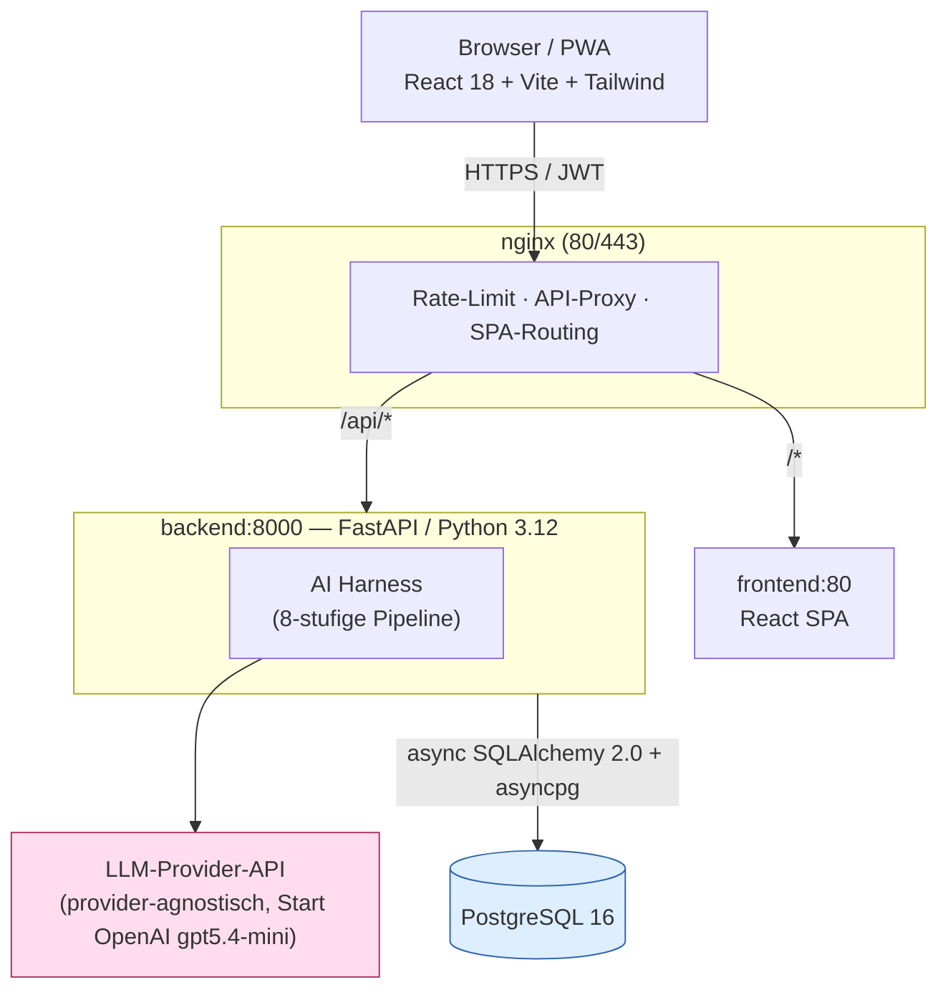
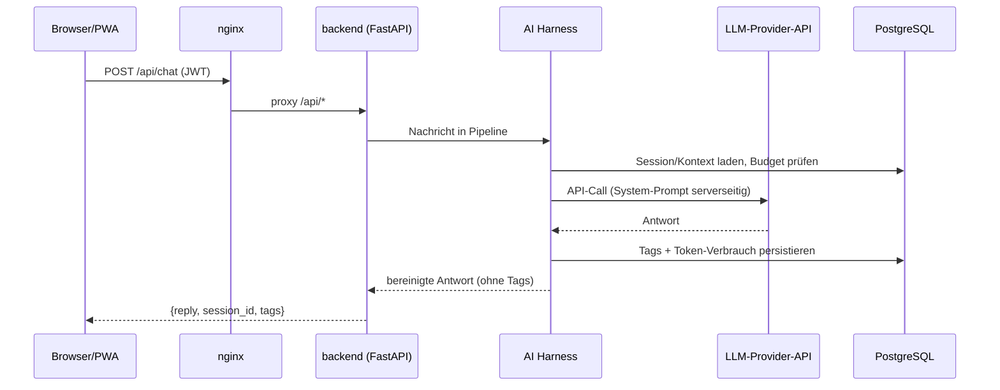

# Software-Architektur

Überblick über die Systemarchitektur von **Schueler-Tutor**. Der gesamte AI-Harness läuft serverseitig — API-Key und System-Prompt erreichen den Browser niemals.

Zurück zu [[CLAUDE]] · Verwandt: [[workflows-pipelines]], [[app-struktur-apis]], [[datenbank-modell]]

## Komponenten-Übersicht

## Request-Fluss (Chat)

Details der Pipeline-Stufen: siehe [[workflows-pipelines]].

## Eckdaten
- **Frontend:** React 18, Vite 5, Tailwind 3, Recharts 2 (PWA, Android-installierbar)
- **Backend:** FastAPI, Python 3.12, async SQLAlchemy 2.0, asyncpg
- **LLM:** provider-agnostisch, Modellwahl **pro Pipeline-Stufe** (Start: OpenAI `gpt5.4-mini` für den Responder) — kein direkter Provider-SDK-Import außerhalb des jeweiligen Adapters (`adapters/openai_adapter.py`, `adapters/claude_adapter.py`)
- **DB:** PostgreSQL 16, alle PKs UUID, alle Timestamps TIMESTAMPTZ (UTC)
- **Deployment:** 4 Container via `docker compose` (nginx, frontend, backend, db)
