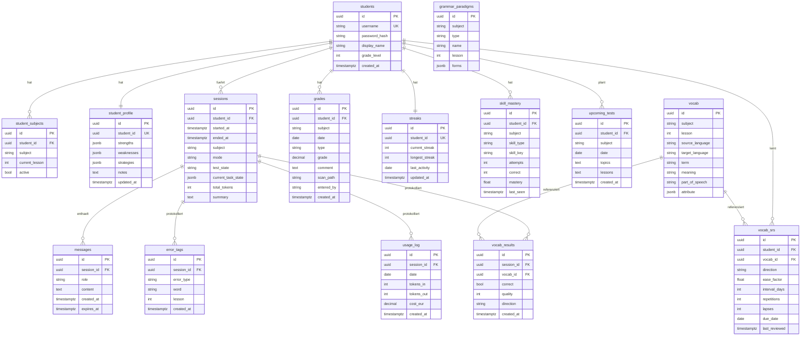

# Datenbankmodell

15 Kern-Tabellen (+ `chat_attachments` in Phase 2.1). Alle PKs: UUID. Alle Timestamps: TIMESTAMPTZ (UTC).

Zurück zu [[CLAUDE]] · Verwandt: [[architektur]], [[app-struktur-apis]]

> **v1.3-Naht:** Betrieb mit GENAU EINEM Schüler, aber alle lernbezogenen Tabellen tragen bereits `student_id`, und `UNIQUE`-Constraints sind auf `(student_id, …)` ausgelegt (Multi-User später ohne Tabellen-Umbau). Event-Logs (`messages`, `error_tags`, `vocab_results`, `usage_log`) erben `student_id` transitiv über `session_id`.

## ER-Diagramm

## Tabellen-Notizen

- **`vocab`** ist fach-/sprachgenerisch: Common-Core-Spalten + `attribute` JSONB.
  - Latein: `{gender, genitive, declension_conjugation, principal_parts}`
  - Englisch: `{irregular_plural, ...}`
  - Fachspezifische Felder **nicht** als Spalten ergänzen, sondern in `attribute`.
- **`vocab_srs`** — SM-2 je `(student, vocab, direction)`, `UNIQUE (student_id, vocab_id, direction)`.
- **`student_profile`** — dauerhaftes Langzeit-Gedächtnis (kein Chat-Volltext).
- **`skill_mastery`** — rollendes Lernstandsmodell, speist Personalisierung + Dashboard. `UNIQUE (student_id, subject, skill_type, skill_key)`.
- **`grammar_paradigms`** — standalone Referenz-Tabellen je Fach, verhindert LLM-Halluzination.
- **`upcoming_tests`** — speist Klassenarbeits-Vorbereitung.
- **UNIQUE-Constraints:** `student_subjects (student_id, subject)`; `student_profile (student_id)`; `streaks (student_id)`.

### Datenhaltung (DSGVO)
- **`messages`**: `expires_at = NOW() + 90d` — Chat-Volltext 90 Tage.
- Dauerhafte Lernerkenntnisse nur aggregiert in `skill_mastery` / `student_profile` (kein Volltext).
- **Geldbeträge**: `DECIMAL(8,6)` EUR (`usage_log.cost_eur`).
