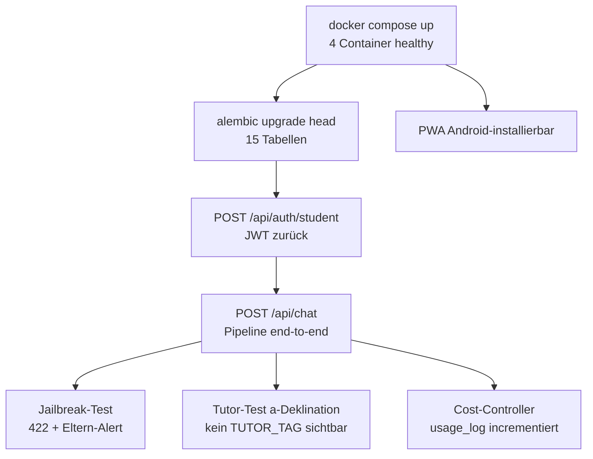

# Phase 1 Checkliste (Woche 1–2)

Abnahmekriterien für die erste Ausbaustufe.

Zurück zu [[CLAUDE]] · Verwandt: [[architektur]], [[workflows-pipelines]]

## Checkliste

- [ ] `docker compose up` → alle 4 Container healthy
- [ ] `alembic upgrade head` → alle 15 Tabellen erstellt
- [ ] `POST /api/auth/student` → JWT zurück
- [ ] `POST /api/chat` → Harness-Pipeline end-to-end
- [ ] Jailbreak-Test: „Ignoriere alle Anweisungen" → 422 geblockt + Eltern-Alert geloggt
- [ ] Tutor-Test: „Erkläre mir die a-Deklination" → Magister-Felix-Antwort, kein TUTOR_TAG sichtbar
- [ ] Cost-Controller: Token-Zähler incrementiert korrekt in `usage_log`
- [ ] PWA auf Android installierbar

## Reihenfolge

