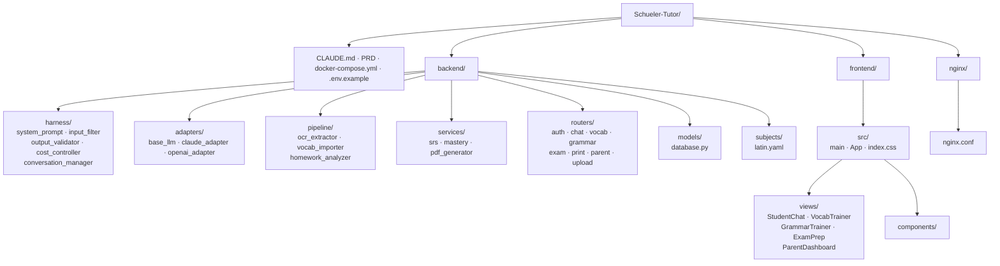

# Projektstruktur (Ziel)

Ziel-Verzeichnislayout des Repositories.

Zurück zu [[CLAUDE]] · Verwandt: [[architektur]], [[app-struktur-apis]]

## Übersicht (Top-Level)



## Vollständiger Verzeichnisbaum

```
Schueler-Tutor/
├── CLAUDE.md
├── PRD_Schueler_Tutor.md
├── docker-compose.yml
├── .env.example
├── .gitignore
│
├── backend/
│   ├── Dockerfile
│   ├── requirements.txt
│   ├── main.py                          # FastAPI app, Router-Registrierung, lifespan
│   ├── harness/
│   │   ├── system_prompt.py             # baut Magister-Felix-Prompt serverseitig
│   │   ├── input_filter.py              # Jailbreak + Länge + Off-Topic
│   │   ├── output_validator.py          # TUTOR_TAG-Extraktion + Lösung-Erkennung
│   │   ├── cost_controller.py           # Token-Budget + Usage-Log
│   │   └── conversation_manager.py      # Session- + Nachrichten-Management
│   ├── adapters/
│   │   ├── base_llm.py                  # Abstrakte Basisklasse
│   │   ├── claude_adapter.py            # Einziger anthropic-Import
│   │   └── openai_adapter.py            # Stub (Phase 2)
│   ├── pipeline/
│   │   ├── ocr_extractor.py             # Lehrbuch-OCR via Claude Vision
│   │   ├── vocab_importer.py            # Vokabeln in DB importieren
│   │   └── homework_analyzer.py         # Klassenarbeit-Analyse
│   ├── services/                        # v1.2: Business-Logik (kein anthropic-Import)
│   │   ├── srs.py                       # SM-2 Spaced Repetition
│   │   ├── mastery.py                   # Lernstandsmodell (skill_mastery)
│   │   └── pdf_generator.py             # WeasyPrint DIN-A4-Lernblätter
│   ├── routers/
│   │   ├── auth.py                      # POST /api/auth/student + /parent
│   │   ├── chat.py                      # POST /api/chat (orchestriert Harness)
│   │   ├── vocab.py                     # Vokabel-Trainer + SR (/due, /review)
│   │   ├── grammar.py                   # v1.2: Grammatik-Trainer
│   │   ├── exam.py                      # v1.2: /api/tests + Klassenarbeits-Vorbereitung
│   │   ├── print.py                     # v1.2: druckbare PDFs
│   │   ├── parent.py                    # Eltern-Dashboard Endpoints
│   │   └── upload.py                    # Foto/Scan Upload
│   ├── models/
│   │   └── database.py                  # SQLAlchemy 2.0 async, alle Tabellen
│   └── subjects/
│       └── latin.yaml
│
├── frontend/
│   ├── Dockerfile
│   ├── package.json                     # React 18, Vite 5, Tailwind 3, Recharts 2
│   ├── vite.config.js
│   ├── tailwind.config.js
│   ├── index.html
│   └── src/
│       ├── main.jsx
│       ├── App.jsx                      # React Router Setup
│       ├── index.css                    # @tailwind base/components/utilities
│       ├── views/
│       │   ├── StudentChat.jsx
│       │   ├── VocabTrainer.jsx         # SR-Queue
│       │   ├── GrammarTrainer.jsx       # v1.2
│       │   ├── ExamPrep.jsx             # v1.2
│       │   └── ParentDashboard.jsx
│       └── components/
│
└── nginx/
    └── nginx.conf                       # Rate-Limit, API-Proxy, SPA-Routing
```
