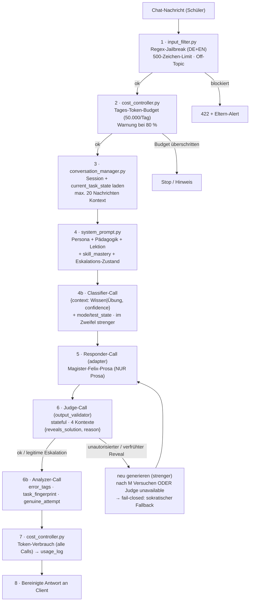
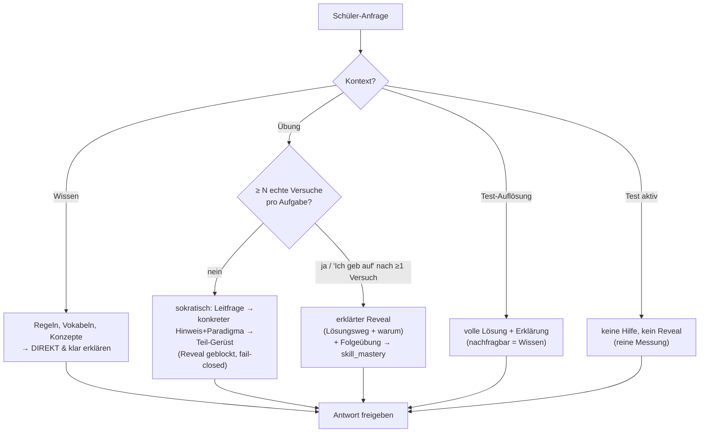
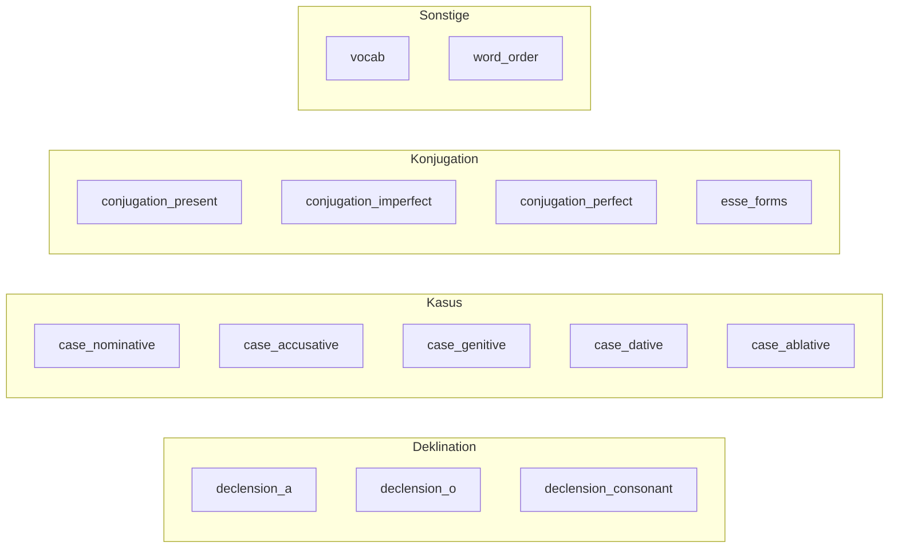
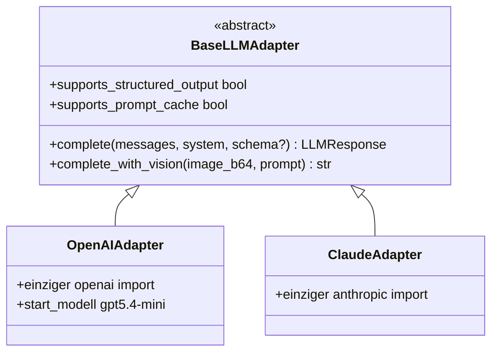
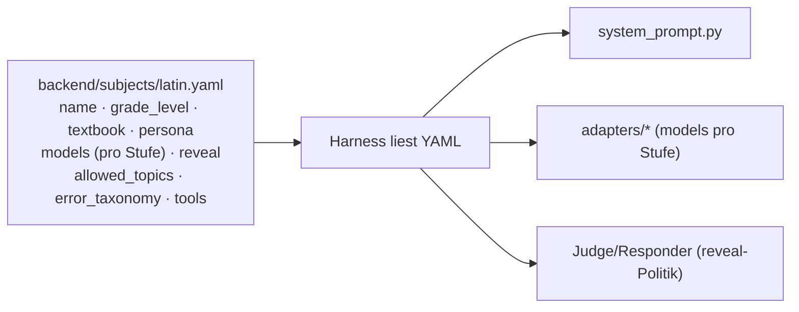

# Workflows & Pipelines

Die **Kernkomponente** des Systems: der serverseitige AI-Harness. Alle Harness-Dateien liegen unter `backend/harness/`. API-Key und System-Prompt erreichen den Browser niemals.

Zurück zu [[CLAUDE]] · Verwandt: [[architektur]], [[datenbank-modell]]

> **v1.5:** Der Harness folgt dem **Vier-Kontext-Modell** (Wissen / Übung / Test aktiv / Test-Auflösung) mit **gestufter Eskalation und Reveal als letztes Mittel**. Der Output-Validator ist ein **stateful LLM-als-Judge** (separater Call), und die Modellwahl ist **provider-agnostisch pro Pipeline-Stufe** (Start: OpenAI `gpt5.4-mini`).

## AI-Harness-Pipeline

Jede Chat-Nachricht durchläuft die Pipeline. Stufen 4b/5/6/6b sind **separate, spezialisierte LLM-Calls** (kein autonomer Agent — deterministischer Workflow).



## Kernprinzip: Vier Kontexte (v1.5)

Der Judge (Stufe 6) ist **stateful** und kennt den Eskalations-Zustand der aktuellen Aufgabe (aus `sessions.current_task_state`). **Im Zweifel gilt der strengere Kontext** (Übung vor Wissen, Test-aktiv vor Auflösung).



**Trigger / Anti-Gaming:** Ein „echter Versuch" ist ein tatsächlicher Lösungsansatz — bloßes „sag die Lösung" / „ich geb auf" ohne Ansatz zählt **nicht** (beurteilt der Analyzer-Call). Schwelle `N` = Default 3, eltern-tunbar **pro Fach** (`reveal.patience_threshold`); expliziter „Ich geb auf"-Pfad nach ≥1 echtem Versuch verkürzt. Versuchszählung **pro Aufgabe** über den Aufgaben-Fingerprint; Aufgabenwechsel → Reset.

## TUTOR_TAG-Format (via Analyzer-Call)

Pädagogik-Signale liefert ein **separater Analyzer-Call als strukturierter Output** — **nicht** der Responder im Fließtext (keine Tag-Leckage in der Schülerantwort, keine Regex-Fragilität, provider-agnostisch). Der Responder gibt **nur Prosa** zurück.

```json
{ "error": "declension_a", "word": "puellam", "lesson": 5,
  "task_fingerprint": "cornelia-puellam-vocat", "same_task_as_previous": true,
  "genuine_attempt": true }
```

- `error_tags` → gespeichert in `error_tags`-Tabelle + Aggregat `skill_mastery`.
- `task_fingerprint` / `same_task_as_previous` / `genuine_attempt` → pflegen `sessions.current_task_state` (Versuchszähler, Eskalations-Zustand).
- Der Schüler sieht nichts davon.

### Fehlertaxonomie (14 Typen)



## LLM-Adapter-Pattern (provider-agnostisch)

**Regel:** Kein direkter Provider-SDK-Import (`openai`, `anthropic`, …) außerhalb des **jeweiligen Adapters**. `BaseLLMAdapter` definiert ein schmales Interface; strukturierte JSON-Ausgabe ist ein **adapter-garantierter Vertrag** (nativ wo unterstützt, sonst Prompt + Parse-Validate-Retry im Adapter) — die Pipeline-Stufen sehen den Unterschied nie.



- **Modellwahl pro Pipeline-Stufe** (Subject-YAML `models:`), nicht global. Start: OpenAI `gpt5.4-mini` für den **Responder**; günstigere Modelle für Classifier/Judge/Analyzer.
- **Fähigkeiten von `gpt5.4-mini`** (Structured Output, Limits, Caching) sind **zur Build-Zeit im Adapter zu verifizieren** — die Capability-Flags steuern nur den günstigeren Pfad, nie die Korrektheit.
- **Preise je aktivem Anbieter** in `cost_controller.py` pflegen; 50.000 Tokens/Tag ≈ ~100 Konversationsrunden (jetzt verteilt über Responder + Classifier + Judge + Analyzer pro Nachricht).
- **Adapter-Fallback-Kette** (Provider A nicht erreichbar → Provider B), da Multi-Provider gefordert ist.

## Subject-Configuration-Pattern

Neues Fach = neue YAML-Datei in `backend/subjects/`, **kein Code nötig**. Reveal-Politik und Modellwahl sind Teil der Fach-Config.



Beispiel:
```yaml
# backend/subjects/latin.yaml
name: Latein
grade_level: 6
textbook: "Campus A, 4. Auflage (C.C. Buchner)"
persona: magister_felix

# Modellwahl pro Pipeline-Stufe (provider-agnostisch; Adapter kapselt den Anbieter)
models:
  responder:  { provider: openai, model: "gpt5.4-mini" }       # qualitäts-/sicherheitskritisch (Start)
  classifier: { provider: openai, model: "<günstiges Modell>" } # Wissen vs. Übung
  judge:      { provider: openai, model: "<günstiges Modell>" } # Output-Validator (≠ Eval-Grader-Modell)
  analyzer:   { provider: openai, model: "<günstiges Modell>" } # Tag-/Fehler-Extraktion
fallback_provider: null   # optionaler zweiter Anbieter für die Adapter-Fallback-Kette

# Reveal-Politik (v1.5) — Fach-Default, von Eltern pro Fach überschreibbar
reveal:
  enabled: true            # Reveal als letztes Mittel im Übungsmodus erlauben
  patience_threshold: 3    # echte Versuche bis Eskalation freigeschaltet (2–4)

allowed_topics:
  - latin
  - roman_history
  - roman_daily_life
  - general_learning
  - smalltalk_brief

error_taxonomy:
  - declension_a
  - declension_o
  # ... (14 Typen gesamt)

tools: []   # Phase 2: Wörterbuch-API o.ä.
```

### Erlaubte Themen (Latein)
`latin` · `roman_history` · `roman_daily_life` · `general_learning` · `smalltalk_brief`
